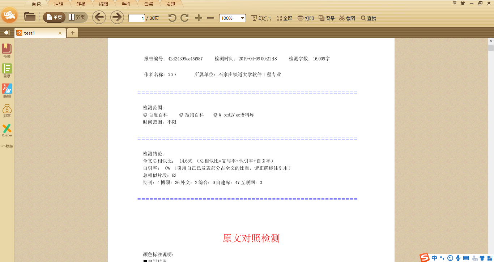

# WeightCheckingPlatform
论文查重平台
 

   
技术：<h3>python+nlp+mysql+pdf</h3>

   
本系统主要使用NLP技术，对文章进行切分，提取关键字，摘要等内容。

   
采用聚类与分类技术，进行文本处理。

   
使用word2vec技术进行文本相似度计算，并绘制最终的pdf文件。

    
已上传的代码可用于在已有数据下的处理工作，未上传语料库。可自行下载使用。

   <h3>最终结果文件展示：</h3>
  
   
  
   
   

